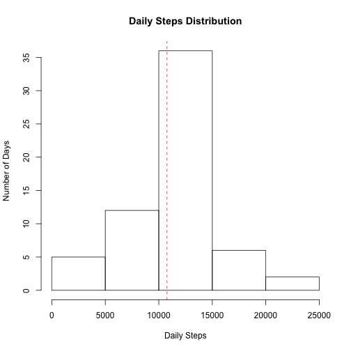

## Loading and preprocessing the data
This code loads the raw CSV data into a data frame, converts the date fields to the Date class, and creates a second data frame with the rows that have NA in the "steps" column removed. We will need this processed data for some applications.


```r
activity <- read.csv("activity.csv")
activity$date<-as.Date(activity$date)
activity.no.na <- activity[!is.na(activity$steps),]
```

## What is mean total number of steps taken per day?
We start by computing the steps totals by day, and determining the mean and median. Then we convert the steps-per-day into a frequency distribution, and plot it as a histogram, along with a line indicating the mean.


```r
daily.totals <- tapply(activity.no.na$steps,activity.no.na$date,sum)
daily.mean <- mean(daily.totals)
daily.median <- median(daily.totals)

dates <- as.Date(names(daily.totals))
date_freq <- rep(dates, daily.totals)
num_breaks <- as.integer(dates[length(dates)] - dates[1])

hist(date_freq, num_breaks, freq=TRUE, xlab="Time", ylab="Number of Steps", main="Total Steps per Day")
abline(h=daily.mean,col="red",lty=2)
axis(4, at=daily.mean, "Mean", col="red")
```

 

**Mean**: 10766.19  
**Median**: 10765

The mean and median are almost identical for this distribution. The histogram shows the daily variation; there are a few spikes in activity in mid to late November.

## What is the average daily activity pattern?
We compute the average number of steps for each interval across all days, then make a time-series plot of that data. Then we get the interval with the maximum number of steps, and add a line to the plot indicating this.


```r
interval.means <- tapply(activity.no.na$steps,activity.no.na$interval,mean)
plot(as.numeric(names(interval.means)),interval.means,type="l",xlab="Intervals",ylab="Average Steps")

max.interval <- as.numeric(names(interval.means[interval.means==max(interval.means)]))
abline(v=max.interval, col="red", lty=2)
axis(1, at=835, col="red")
```

 

The **835 interval** contains the **maximum** number of steps, on average.

## Imputing missing values
Let's begin by computing the number of missing values in the dataset.

```r
total.missing <- sum(is.na(activity$steps))
```
There are **2304 missing values**.
Let's use interval means to fill these missing values. The code below builds a new dataset where missing values are filled in this way.

```r
activity2 <- activity
for (i in 1:nrow(activity2)) {
    if (is.na(activity2$steps[i])) { 
      activity2$steps[i] <- interval.means[as.numeric(names(interval.means))==activity2$interval[i]] 
    }
}
```

Now let's recreate the steps histogram and recompute the mean and median using this new dataset.

```r
daily.totals2 <- tapply(activity2$steps,activity2$date,sum)
daily.mean2 <- mean(daily.totals2)
daily.median2 <- median(daily.totals2)

dates2 <- as.Date(names(daily.totals2))
date_freq2 <- rep(dates2, daily.totals2)
num_breaks2 <- as.integer(dates2[length(dates2)] - dates2[1])

hist(date_freq2, num_breaks2, freq=TRUE, xlab="Time", ylab="Number of Steps", main="Total Steps per Day")
abline(h=daily.mean2, col="red", lty=2)
axis(4, at=daily.mean2, "Mean", col="red")
```

 

**Mean**: 10766.19  
**Median**: 10766.19

The mean remains the same as before, and the median is now equal to the mean. This makes sense, because the NA values were for full days, so the total for each of those days would be equal to the daily mean. So this transformation has added data for these NA days, each of which has a daily total that's exactly equal to the mean that we computed. This addition does not alter the mean.

## Are there differences in activity patterns between weekdays and weekends?

We start by adding a new factor variable that indicates whether a given date is a weekday or a weekend.

```r
wd<-weekdays(activity2$date)
for (i in 1:length(wd)) {
	if (wd[i] == "Sunday" | wd[i] == "Saturday") {activity2$day[i] = "weekend"}
	else {activity2$day[i] = "weekday"}
}
activity2$day <- as.factor(activity2$day)
```

Now let's see if the weekday vs weekend activity patterns look different by plotting them side by side, with the same y-axis limits. We also compute the daily means for weekdays vs weekends.

```r
week.days <- activity2[activity2$day == "weekday",]
week.ends <- activity2[activity2$day == "weekend",]
weekday.interval.means <- tapply(week.days$steps,week.days$interval,mean)
weekend.interval.means <- tapply(week.ends$steps,week.ends$interval,mean)

par(mfrow=c(1,2))
plot(as.numeric(names(weekday.interval.means)),weekday.interval.means,type="l",xlab="Interval",ylab="Number of steps",ylim=c(0,180), main="Weekdays")

plot(as.numeric(names(weekend.interval.means)),weekend.interval.means,type="l",xlab="Interval",ylab="Number of steps",ylim=c(0,180), main="Weekends")
```

 

```r
weekday.totals <- tapply(week.days$steps,week.days$date,sum)
weekday.mean <- mean(weekday.totals)
weekend.totals <- tapply(week.ends$steps,week.ends$date,sum)
weekend.mean <- mean(weekend.totals)
```

The plots seem to indicate more activity on weekends on average (though the peak activity interval is higher on weekdays). This is confirmed by looking at the daily means for weekdays vs weekends. For weekdays, the mean is **10255.85**, while for weekends it is **12201.52**.
